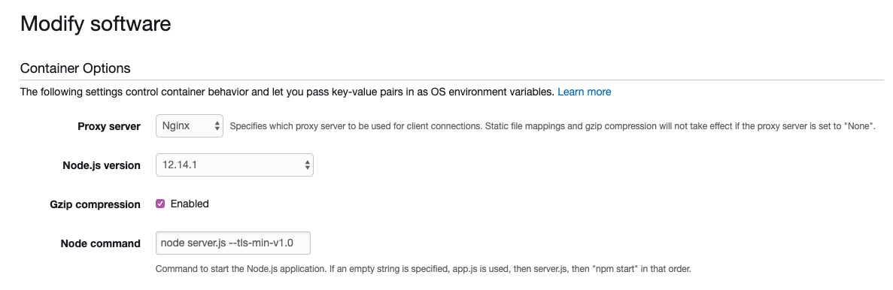

# Beanstalk NODE COMMAND 옵션 사용법

사내에서 AWS Beanstalk를 이용해 서버를 구성하고 있느데 API-Server를 Node V12로 올리면서 SSL 이슈가 터졌다. Node V12는 TLS Version이 1.0에서 1.2로 상향되었는데 일부
매체사에서는 아직도 1.0을 사용하고 있다. 그렇기 때문에 서버를 구동 시킬때 Option으로 `--tls-min-v1.0`으로 넣어줘야 하는데 Beanstalk에서 Option을 주는 법을 기록해 본다.

## 사용법

수정할 Elastic Beanstalk 선택 -> Configuration -> Modify Software를 들어가면 다음과 같은 화면이 보인다.



여기에 `Node Command`라고 입력 필드가 있는데 이곳에 넣어주면 된다. 기본적으로 입력 필드가 빈칸일 경우 다음 순서로 서버가 구동된다.
1. app.js
2. server.js
3. npm start

그런데 특정 명령어 를 넣어줘야 될 경우 아래처럼 실행 명령어를 모두 입력해야 한다. (자동으로 node가 입력 될 줄 았았는데.. 오늘도 삽질...)

``` text
node server.js --tls-min-v1.0
```