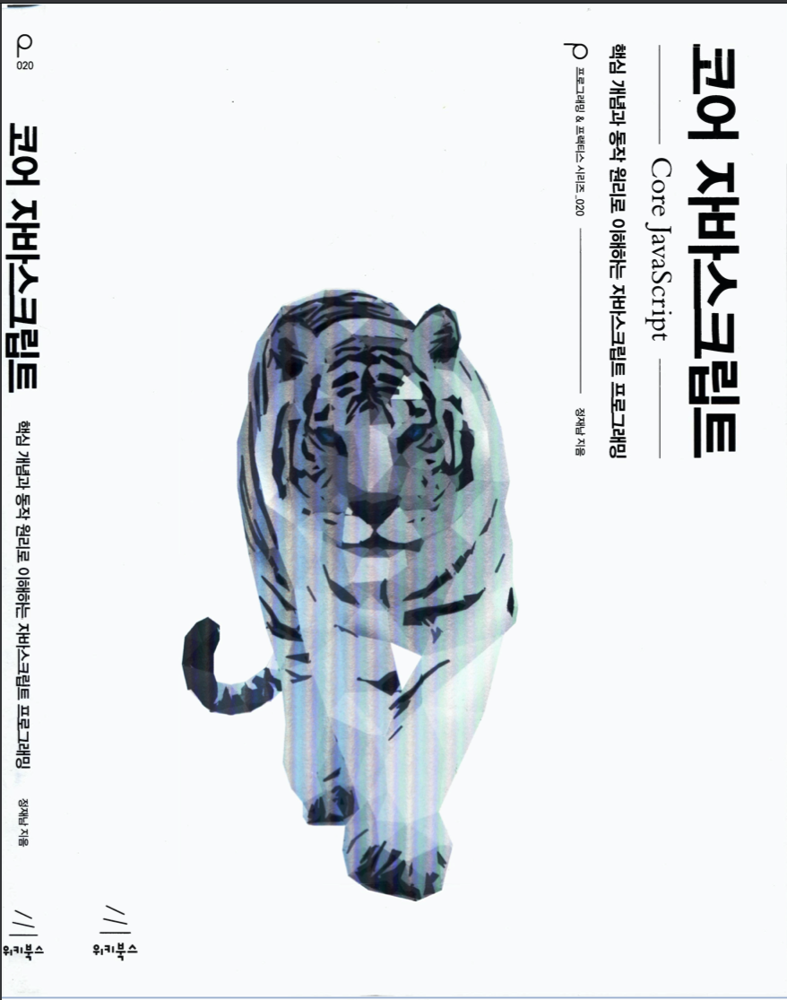

# 코어 자바스크립트

## 책 정보

|지은이|옮긴이|출판사|독서 시작날짜|독서 완독날짜|
|----|-----|----|---------|----------|
|정재남||위키북스|2020.04.22||

위 책을 공부하면서 정리한 repository이다.

## 내용 정리

1. [데이터타입](contents/part_1.md)
2. [실행 컨텍스트](contents/part_2.md)
3. [this](contents/part_3.md)
4. 콜백 함수
5. 클로저
6. 프로토타입
7. 클래스