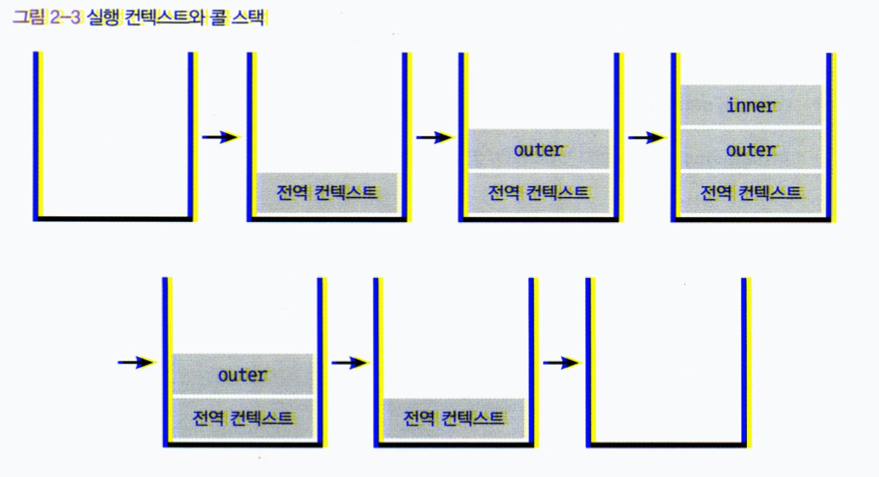

# 코어 자바스크립트

## 날짜: 2020.05.25 ~ 2020.05.27

## Part_1. 실행 컨텍스트

### 목차

1. [실행 컨텍스트란?](#실행-컨텍스트란)
2. [VariableEnvironment](#variableenvironment)
3. [LexicalEnvironment](#lexicalenvironment)
    - [environmentRecord와 호이스팅](#environmentRecord와-호이스팅)
    - [scope chain](#scope-chain)
4. [this](#this)

#### 실행 컨텍스트란?

- *실행 컨텍스트(execution context)*는 실행할 코드에 제공할 환경 정보들을 모아놓은 객체로, 자바스크립트의 동적 언어로서의 성격을 가장 잘 파악할 수 있는 개념이다.
- *동일한 환경*에 있는 코드들을 실행할 때 필요한 환경 정보들을 모아 컨텍스트를 구성하고, 이를 *콜 스택(call stack)*에 쌓아 올렸다가, 가장 위에 쌓여 있는 컨텍스트와 관련 있는 코드들을 실행하는 식으로 전체 코드의 환경과 순서를 보장한다. 여기서 *동일한 환경*, 즉 하나의 실행 컨텍스트를 구성할 수 있는 방법으로는 다음과 같은 방법이 있다.
  - 전역공간
  - eval() 함수
  - 함수

- 다음과 같은 코드가 존재 할때 콜 스택이 어떻게 쌓이는지 살펴보자.
  
  ``` js
  // (1)
  var a = 10;
  function outer() {
    function inner() {
      console.log(a)  // undefined
      var a  = 3;
    }
    inner(); // (2)
    console.log(a);   // 1
  }
  outer();  // (3)
  console.log(a);
  ```

  1. 처음 코드를 실행하면 전역 컨텍스트가 콜스택에 담긴다. (a, inner function들이 담긴다)
  2. (3)에서 outer 함수가 호출되면서 자바스크립트 엔진은 outer에 대한 환경 정보를 수집해서 outer 실행 컨텍스트를 생성한 후 콜 스택에 담고 outer 함수의 내부 코드들을 순차적으로 실행한다.
  3. (2)에서 inner 함수가 호출되면서 마찬가지로 자바스크립트 엔진은 inner에 대한 환경 정보를 수집해서 inner 실행 컨텍스트를 생성한 후 콜 스택에 담고 inner 함수를 순차적으로 실행한다.
  4. inner 함수코드가 끝나면 inner 실행 컨텍스트가 콜 스택에서 제거 되며, 다음 콜 스택인 outer 컨텍스트가 중단됬던 (2)의 다음줄부터 실행된다.
  5. outer 함수코드가 끝나면 outer 실행 컨텍스트가 콜 스택에서 제거 되며, 다음 콜 스택인 전역 컨텍스트가 중단됬던 (3)의 다음줄 부터 실행된다.
  6. 전역 코드가 끝나면 전역 컨텍스트도 끝나고, 콜 스택에는 아무것도 남지 않는 상태로 종료된다.

  

- **실행 컨텍스트가 콜 스택의 맨 위에 쌓이는 순간이 곧 현재 실행할 코드에 관여하게 되는 시점임을 알 수 있다.**
- 어떤 실행 컨텍스트가 활성화될 때 자바스크립트 엔진은 해당 컨텍스트에 관련된 코드들을 실행하는 데 필요한 환경 정보들을 수집해서 실행 컨텍스트 객체에 저장한다. 이 객체는 자바스크립트 엔진이 활용할 목적으로 생성할 뿐 개발자가 코드를 통해 확인할 수는 없다.
  - **VariableEnvironment**
    - 현재 컨텍스트 내의 식별자들에 대한 정보 + 외부 환경 정보, 선언 시점의 LexicalEnvironment의 스냅샷으로, 변경 사항은 저장되지 않는다.
  - **LexicalEnvironment**
    - 처음에는 VariableEnvironment와 같지만 변경 사항이 실시간으로 반영됨
  - **ThisBinding**
    - this 식별자가 바라봐야 할 대상 객체

#### VariableEnvironment

- **VariableEnvironment**에 담기는 내용은 **LexicalEnvironment**와 같지만 최초 실행 시의 스냅샷을 유지한다는 점이 다르다. 실행 컨텍스트를 생성할 때 **VariableEnvironment**에 정보를 먼저 담은 다음, 이를 그대로 복사한게 **LexicalEnvironment**이고 이후에는 이를 이용한다.
- **VariableEnvironment** 내부에는 **environmentRecord**와 **outer-EnvironmentReference**로 구성되어 있다.
- **LexicalEnvironment** 와는 사실상 거의 동일하다.

#### LexicalEnvironment

- **LexicalEnvironment**를 풀어서 설명하면 *"현재 컨텍스트의 내부에는 a, b, c와 같은 식별자들이 있고 그 외부 정보는 D를 참조하도록 구성돼 있다"*로 정리할 수 있다.
- 결국 컨텍스트는 환경 정보들을 구성해놓은 일종의 사전이라 정리 할 수 있을것 같다.

##### environmentRecord와 호이스팅

- **environmentRecord**
  - **environmentRecord**에는 현재 컨텍스트와 관련된 코드의 식별자들이 저장된다. ( 변수, 함수 등)
  - 컨텍스트 내부 전체르르 처음부터 쭉 훑어나가며 **순서대로** 수집한다.
  - 변수 정보를 수집하는 과정을 모두 완료했더라도 아직 실행 컨텍스트가 관여할 코드들은 실행하기 전의 상태이다. 변수 정보만 우선 수집하는 것인데 결국 자바스크립트 엔진은 코드 실행전에 모든 변수들을 알고 있게 되는 것이다.
- **호이스팅(hoisting)**
  - **호이스팅(hoisting)**이란 **끌어 올린다**의 뜻을 가지고 있는데 사실 변수들을 실제로 끌어 올리는 것은 아니다. 다만 바로 위에서 말했다시피 변수 정보를 우선 수집하면서 모든 정보를 알게 되면서 모든 정보를 코드를 실행전에 알기 때문에 끌어올리다란 뜻으로 간주하는 것이다.
  - **environmentRecord**는 변수의 경우 어떤 식별자들이 있는지만 수집한다. 해당 식별자가 어떤 값을 가지고 있는지는 수집하지 않기 때문에 **변수명만 수집하고 할당과정은 원래 자리에 남겨둔다.**
  - **함수 선언의 경우에는 함수 전체를 끌어 올린다.**
    - 함수에는 **함수 선언문(function declaration)**과 **함수 표현식(function expression)** 두가지가 존재한다.
    - 함수 선언문은 `function a {}` 형태로 a가 곧 변수명이 되는 것이고, 함수 표현식은 `var b = function () {}` 형태로 b가 곧 변수명이자 함수명이 된다.
    - **이 경우 함수 선언문 함수이므로 함수 전체를 호이스팅 하지만 함수 표현식의 경우 변수명이 있으므로 변수명만 호이스팅한다.**
- 호이스팅으로 인해서 협업을 진행할때 문제가 생기도 하는데 이를 방지하려면 다음처럼 작업을 하는것을 고려해야 한다.
  - 전역공간에 함수를 선언하거나 같은 이름의 함수를 중복 선언하는 경우를 방지해야 한다. ( 보통 lint에서 이를 막을 수 있다. )
  - 함수 선언문 대시 함수 표현식으로 사용하자.

##### scope chain

- **scope**란 식별자에 대한 유효 범위를 뜻한다.
- 스코프의 개념은 대부분의 언에 존재한다.
- 자바스크립트는 **ES5**에서는 **함수**에 의해서만 스코프가 생성됬지만 **ES6**부터는 **블록**에 의해서도 스코프가 생성된다. 다만 var로 선언한 변수에는 적용되지 않고 let, const, class, strict mode에서의 함수 선언 등에 대해서만 스코프가 생성된다.
- outerEnvironmentReference는 현재 호출된 함수가 선언될 당시의 LexicalEnvironment를 참조 한다.
- 여러 scope에서 동일한 식별자를 선언한 경우에는 **무조건 스코프 체인 상에서 가장 먼저 발견된 식별자에게만 접근 가능하다.**

#### this

- 실행 컨텍스트의 thisBinding에는 this로 지정된 객체가 저장된다.
- 실행 컨텍스트 활성화 당시 this가 지정되지 않은 경우에는 this에는 전역 객체가 저장된다. 또한 함수를 호출하는 방법에 따라서 this가 저장되는 대상이 다르게 된다.

>위 정리글은 코어 자바스크립트(Core JavaScript)에서 인용한 것입니다.

>[ISBN 979-11-5839-172-0 (93000)] Copyright 2019 by 정재남
