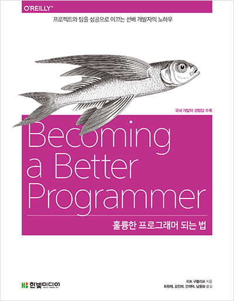

# 훌륭한 프로그래머 되는 법

## 책 정보

|지은이|옮긴이|출판사|독서 시작날짜|독서 완독날짜|
|----|-----|----|---------|----------|
|피트 구들리프|최원재, 강전희, 인재덕, 남윤화|한빛 미디어| 2019.08.21||

위 책을 공부하면서 정리한 repository이다.

## 내용 정리

1. [Part 1. you.write(code);](contents/part_1.md)
2. [Part 2. 연습을 통해 완벽해진다](contents/part_2.md)
3. [Part 3. 개인적인 일로 받아들이기](contents/part_3.md)
