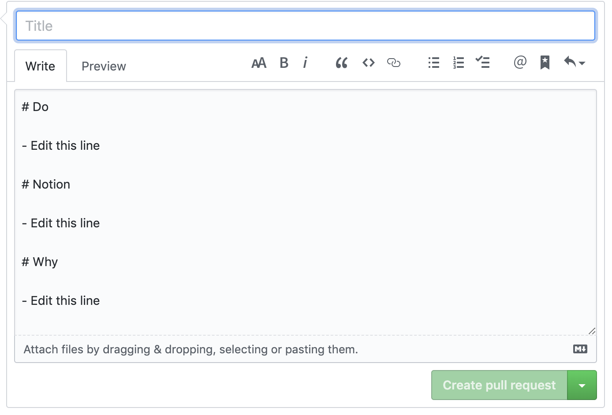

# Pull Request 템플릿 적용하기

현재 사내에서 **Github Pull Request**를 이용해 코드리뷰를 진행하고 있는데, **PR**을 진행할때 사람마다 적는 내용/형식이 천처만별이라 이를 통일하자는 의견을 제시 했었다. 결국 통과 되었고 다음처럼 템플릿이 정해졌다.

``` markdown
# Do

- Edit this line

# Notion

- Edit this line

# Why

- Edit this line
```

**Do**는 무엇을 하였는지, **Notion**은 노션 링크 페이지, **Why**는 왜 이 작업을 하였는지를 작성하면 된다.

## 적용 방법

1. **Repository** 최상단으로 이동한다.
2. **.github** 디렉토리를 생성한다.
3. 위 디렉토리에 **PULL_REQUEST_TEMPLATE.md**라는 파일을 만들고 그 안에 markdown 형식으로 내용을 추가한다.
4. 이를 Merge하면 이후 **Pull Request**에 템플릿이 적용 된것을 볼 수 있다.

