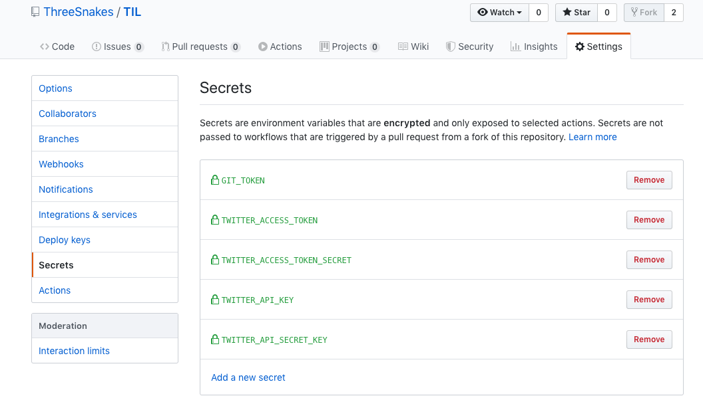

# Github secret 사용법

TIL 레파지토리에 **twitter-together**를 적용하면서 **secret key(twiiter api key 등)**을 어떻게 해야 되나 싶었는데 방법을 찾았다.

레파지토리 **Setting**에 가면 **Secrets** 메뉴가 있는데 여기 key/value 형태로 저장이 가능하다.



해당 키를 **Github action**에서 사용할 때는 다음처럼 사용하면 된다.

``` yml
on: [push]
name: Twitter, together!
jobs:
  tweet:
    name: Tweet
    runs-on: ubuntu-latest
    if: github.event_name == 'push' && github.ref == 'refs/heads/master'
    steps:
      - uses: gr2m/twitter-together@v1.x
        env:
          GITHUB_TOKEN: ${{ secrets.GIT_TOKEN }}
          TWITTER_ACCESS_TOKEN: ${{ secrets.TWITTER_ACCESS_TOKEN }}
          TWITTER_ACCESS_TOKEN_SECRET: ${{ secrets.TWITTER_ACCESS_TOKEN_SECRET }}
          TWITTER_API_KEY: ${{ secrets.TWITTER_API_KEY }}
          TWITTER_API_SECRET_KEY: ${{ secrets.TWITTER_API_SECRET_KEY }}
```
